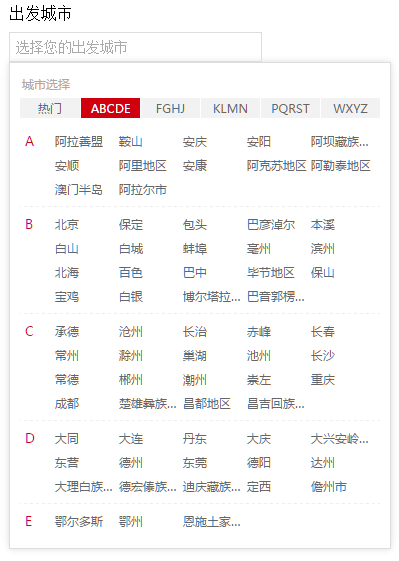

# vue-city-picker

vue城市选择组件（按城市首字母排序）


## 更新日志

### @1.0.0
- 我出生了


## demo

示例（vue@1.0+） [点我](http://dai-siki.github.io/vue-city-picker/example/demo.html).


## 截图





## 依赖

基于 vue.js@1.0+ 版本，模块使用es6编写（需babel转译），css使用scss编译（需scss-loader转译）。


## 安装

#### npm

```shell
$ npm install vue-city-picker
```

## 使用

参考示例，城市列表需要按指定的格式，并声明全局变量。

#### 相关参数

| 名称              | 类型               | 默认             | 说明                                         |
| ----------------- | ----------------- | ---------------- | --------------------------------------------- |
| value             | String            | ""               | 要双向绑定的城市Id                |
| field             | String            | ""               | 会给input标签添加name及id属性                   |
| placeholder       | String            | ""               | 你懂的                                     |


#### 示例(vue@1.0+)

```html

<div id="app">
	<label for="city">选择购车城市</label>
	<city-picker field="city" placeholder="选择日期" :value.sync="cityId"></city-picker>
</div>

<script>
/**
 * 引入城市列表，格式：
 * {
 * 		//热门
 * 		hot:[
 * 			{id:1, name:'北京'}
 * 		],
 * 		A:[
 * 			{id:2, name:'澳门'}
 * 		]
 * 	}
 */
import cityList from 'vue-city-picker/json/city-picker-list.json';
//因为使用了es6的一些方法，需要babel垫片，如果你项目中已有相关兼容性方案，可忽略
import 'babel-polyfill';
import Vue from 'vue';
import myCityPicker from 'vue-city-picker';

//注册一个城市列表全局变量（考虑到cityList会比较大，如项目中多次使用，单独为一个js文件比较好）
window.CITY_PICKER_LIST = cityList;

new Vue({
	el: '#app',
	data: {
		cityId: ''
	},
	components: {
		'city-picker': myCityPicker
	}
});

</script>

```
